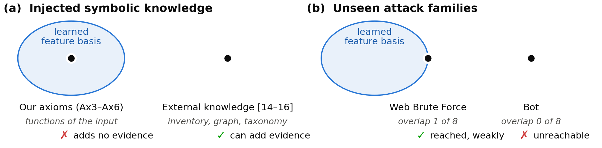
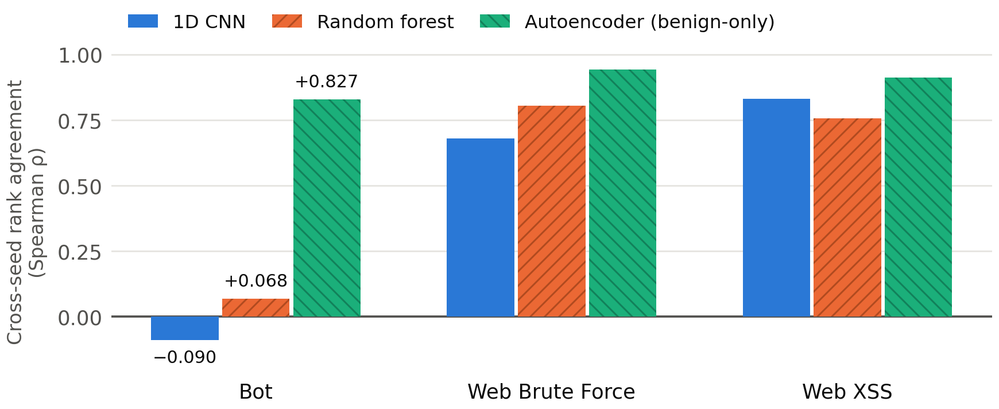

# Knowledge the Network Already Has: An Exogeneity Precondition for Neuro-Symbolic Intrusion Detection

> **Build note — not part of the paper.** Derived from [paper_draft.md](paper_draft.md), which
> remains the full verified research record. Every quantity here is checked by `verify_draft.py`
> against `outputs/metadata/*.json`, over this file and [paper_supplementary.md](paper_supplementary.md)
> together. `md_to_latex.py` strips this block when it generates the LaTeX.

---

## Abstract

Neuro-symbolic intrusion detectors that report gains from injected knowledge tend to share a property
that is rarely stated: the knowledge they add, whether an asset inventory, a relational graph or an
external attack taxonomy, is information the neural network could not compute from its input. Our own
system did not have this property. Its Logic Tensor Network axioms are deterministic functions of the
flow features the network already receives. On its own the symbolic component had no measurable effect
(−0.0004, n.s.), and it was worse than the same trainer run without axioms in all 17 CNN training runs
we paired it with, alone and combined with a knowledge-graph channel. We argue that symbolic knowledge
can help a neural detector only to the extent that it lies outside the model's learned feature basis,
and we ask whether the same condition explains a second failure. None of the eight features that best
separate Bot from benign traffic is among the eight that a model of the known-class task relies on most,
and every Bot flow is classified as benign in all 17 of our CNN training runs. This failure held under
five attempts to overturn it, among them an independent capture in which Bot is common and a relabelled
release of the dataset. The overlap account is not complete, however: a random forest tuned on
validation reaches Bot in part without relying more on Bot's features, as a test we specified in advance
showed. We then tried to build knowledge on CIC-IDS2017 that meets the precondition and could not.
Host-role predicates derived from metadata the network never sees can still be predicted from its
features, with AUC 0.990–0.994. Knowledge aggregated from the capture itself is not exogenous, and a
benchmark with no external knowledge source therefore cannot support the experiment that published
neuro-symbolic gains rely on.

---

## 1 Introduction

A common argument for neuro-symbolic learning is that domain knowledge written as logic can make up for
what the training data lacks. Intrusion detection looks like a good place to test this. A data-driven
detector is weakest on attacks that never appeared in training, and those are the cases where knowledge
about how networks and attacks behave should matter most.

We built a neuro-symbolic intrusion detector to test the idea, and it did not work. Its Logic Tensor
Network axioms encode behaviours such as burst traffic, packet-size variance and destination ports
outside the standard service ports. Alone they changed macro zero-day PR-AUC by −0.0004, which is not
significant. Compared with the same trainer run without axioms, they made the system worse with every
one of the 17 CNN training runs we paired them with, whether or not a knowledge-graph channel was added.
This paper sets out to explain that outcome, and we think the explanation applies beyond our system.

Published systems that do report gains have something ours did not. Grov et al. [14] add a single axiom
stating that flows which do not involve a web server cannot be web attacks, and roughly double their
web-attack precision. KnowGraph [15] reasons over relations between entities and raises the true-positive
rate from 0.0 % to 35.5 % at a 0.5 % false-positive rate, a setting in which the neural baseline detects
nothing. Kalutharage et al. [16] map alerts onto an external attack taxonomy. In all three, the added
knowledge is something the network could not have worked out from its own input. Each of our behaviour
predicates, in contrast, is a fixed function of flow features the network already reads, so at most it
could act as an inductive bias. It could not add evidence.

We state this as a precondition: symbolic knowledge helps a neural detector to the extent that it lies
outside the model's learned feature basis. The paper makes three contributions around it.

1. **One principle, and how far it reaches (§3–§4).** Knowledge that falls inside the learned basis adds
   nothing. We ask whether the same condition explains attack families that are absent from training:
   our CNN never reaches Bot, whose discriminative features are not among those the known-class task
   relies on. A tuned random forest reaches Bot in part without relying more on those features, so
   overlap is an account of the CNN's failure, not a general law.
2. **A durability test (§5).** The unreachability survives five separate attempts to break it: a capture
   in which the family is plentiful, corrected labels, an explicitly trained reject class, cross-dataset
   augmentation, and a sweep over architectures and out-of-distribution scorers.
3. **A negative result on evaluability (§6).** Host-role knowledge built from metadata that the network
   never sees can still be recovered from the network's features. A benchmark without an external
   knowledge artefact cannot host the experiment on which published neuro-symbolic gains depend.

**Figure 1.** *One principle, two consequences.* Both panels show the same learned feature basis, that
is, the features a closed-set objective selects. (a) Symbolic knowledge can only help from outside the
basis. Our Logic Tensor Network axioms are functions of the flow features and add no evidence, while the
knowledge used in published systems [14–16] cannot be computed from the input. (b) Our account of unseen
families: a family is reached as far as it overlaps the basis. Web Brute Force shares 1 of 8
discriminative features and is reached only weakly once label artefacts are removed (§7). Bot shares none
and is not reached by the CNN. A tuned random forest reaches Bot in part without relying more on its
features (§4), so panel (b) describes our CNN rather than every model. Note that inside and outside lead
to opposite outcomes in the two panels.

Two measurement problems limit the magnitudes we can report (§7), and we show both on our own system.
The metric most papers report cannot separate methods by zero-day ability. In addition, once the labels
are corrected, two of our three main zero-day families turn out to have been measuring whether the
dataset labels a failed connection attempt as an attack. These problems cap what we can claim about
effect sizes, but they do not affect the CNN's failure on Bot.

---

## 2 Setting and measurement

**Data.** We use the CIC-IDS2017 [1] flow features, 68 numeric features per flow. Nine attack families
and benign traffic are treated as known. They are split 80/10/10 with stratification, and benign traffic
is under-sampled to a 1:1 ratio, giving 883,796 training, 110,475 validation and 114,658 test flows. Six
rare families (Bot, Heartbleed, Infiltration, and Web Attack Brute Force, XSS and SQL Injection) occur
only in the test set. Under-sampling benign traffic raises the attack base rate about fourfold, so
absolute PR-AUC values here are higher than they would be at the capture's own prevalence (Appendix A).

**Metric.** Our main metric is macro zero-day PR-AUC over the three unseen families with enough samples:
Bot (n = 1,956), Web Attack Brute Force (n = 1,507) and Web Attack XSS (n = 652). Heartbleed (n = 11),
Infiltration (n = 36) and SQL Injection (n = 21) are too small and are left out. PR-AUC cannot fall below
the prevalence of the positive class, so when test sets differ in prevalence (between datasets or
between labellings) we compare lift, defined as PR-AUC divided by prevalence. A random ranker has a lift
of 1.0.

**Reproducibility.** Without determinism flags, training at a fixed seed does not give identical results,
so we measured run-to-run variation before comparing any methods. The standard deviation is 0.0222 from
nondeterminism alone, 0.0171 across seeds with determinism enabled (n = 6) and 0.0228 across data
splits, which puts the uncertainty on a single absolute number at about 0.0285. All comparisons are
paired on seed. We call a difference established only if its sign is the same on every seed, and we give
magnitudes as ranges. This procedure led us to withdraw one of our own earlier claims: a gap of 0.9 SD
that a paired bootstrap had reported as significant (p = 0.001; supplementary §E).

---

## 3 A symbolic pillar that could not help

**Architecture.** The system has three parts: a 1D CNN over the flow features, a Logic Tensor Network [7]
layer that grounds fuzzy axioms in network behaviours, and a knowledge-graph channel that scores how
quickly clusters of flows grow over time. The axioms (Ax3–Ax6) tie the network's attack output to
behaviour predicates such as large packets with high size variance, bursts, scan-like probing and a
destination port outside a list of standard service ports (`BeaconLike`).

**Results.** We tried injecting the axioms at the loss, at the representation and at inference. In every
case the symbolic component either lowered macro zero-day PR-AUC or left it unchanged. On its own it
contributes −0.0004 (n.s.). The cleaner test holds everything but the axioms fixed: the same trainer
with the axiom weight at zero. Against it, the axioms lower macro zero-day PR-AUC with each of the 11
CNN runs trained before our determinism controls (by 0.0062 on average) and each of the 6 trained after
(0.0068), and by more when a knowledge-graph channel is also fused (0.0212 and 0.0324). An earlier
version of this comparison, which added the axioms on top of a knowledge-graph fusion built on three
CNN runs, reported a significant loss; that fusion does not hold across CNN runs (supplementary §D),
so we report the matched comparison instead. One axiom seemed at first
to help on Bot, but the effect disappeared when we repeated the experiment over several seeds. Because
the sign of the effect is the same in every configuration, we do not think better tuning would change
the conclusion.

Comparing our system with published ones that report gains suggests why:

| system | knowledge injected | computable from the flow features? |
|---|---|---|
| Grov et al. [14] | flows not involving a web server are not web attacks | no, needs an asset inventory |
| KnowGraph [15] | logic over relations between entities | no, needs a relational graph |
| Kalutharage et al. [16] | mapping of techniques to an attack taxonomy | no, needs an external taxonomy |
| ours | behaviour predicates (Ax3–Ax6) | yes, each is a function of the input |

All seven of our behaviour predicates are deterministic functions of features the network already
consumes. `HighEntropy`, for example, is the standard deviation of packet length rather than Shannon
entropy, and `BeaconLike` depends on the destination port. `BeaconLike` was also selected by testing candidate
encodings against Bot flows, which belong to a zero-day family, so it is not a clean test of transfer to
unseen attacks. The axioms made no positive difference, so this weakens nothing we conclude, but a
positive result from it would not have counted. A predicate that the network can compute
for itself carries no new information. The most it can do is reshape the hypothesis space, which is a
form of regularisation. In short, the knowledge we injected was endogenous.

This leads to the precondition we propose: *symbolic knowledge helps a neural detector to the extent
that it lies outside the model's learned feature basis.* The next section shows that the same condition
also accounts for a failure that at first seems unrelated.

---

## 4 One principle, two consequences

A closed-set discriminative model learns the features that separate the classes in its training
objective and has no reason to learn others. It follows that a class the model has never seen can be
reached only as far as that class's signature overlaps the learned basis. This is the precondition of
§3 again, with an unseen class in the place of an injected predicate. When the overlap is empty,
nothing in the training objective constrains the model's output on the class.

Bot is a case where the overlap appears to be empty, and we use it to test this account:

- In all 17 CNN training runs, 100 % of Bot flows are classified as BENIGN, with a mean p(BENIGN) of at
  least 0.998 in every run. The model is not uncertain about Bot; it is confidently wrong, so
  confidence-based rejection methods have nothing to work with.
- The eight features that best separate Bot from benign traffic have 0 of 8 in common with the eight
  that a gradient-boosted model of the known-class task uses most. This belongs to that model's
  importance ranking rather than to the task: two random forests trained on the same task each have 2 of
  the 8 among their own top eight.
- Bot is the family whose ranking agrees least between training runs (Figure 2). Over all 15 pairs of
  six deterministic CNN runs, the median Spearman correlation on Bot flows is +0.55, and single pairs
  range from −0.52 to +0.92; the web families have medians of +0.81 and +0.93. The 11 runs trained before
  we enabled determinism look the same (median +0.59). The three runs we first analysed gave −0.090, the
  low end of this range rather than its typical value, and we no longer describe the Bot ranking as
  noise. Nor is the inconsistency a property of closed-set training in general. A random forest with
  default feature sampling shows it (ρ = 0.068), but with the number of features per split selected on
  validation the same forest gives +0.923 and ranks Bot at 6.4 times chance (Appendix C).
- The information is available in the features. An oracle trained with Bot labels reaches a PR-AUC of
  0.9988 from the same inputs. It uses zero-day labels and so is an upper bound rather than a usable
  method, but it shows that the obstacle is the lack of supervision, not missing information or the
  choice of input modality.

**Figure 2.** *Agreement between training runs, by family.* Each bar shows how well a model's ranking of
one unseen family's test flows agrees between training runs (Spearman ρ), and each line shows the range
over pairs of runs. The CNN bar is the median over all 15 pairs of six deterministic runs; the forests
and the autoencoder have three runs each. Bot is the CNN's least consistent family and its most variable
one. A random forest with default feature sampling is also inconsistent on Bot, but the same forest with
its feature sampling selected on validation is the most consistent model on Bot, so the inconsistency
depends on the model's configuration and not only on closed-set training.

Taken together, knowledge that lies inside the basis (our axioms) adds no evidence, and a class that lies
outside it (Bot) is not reached by the CNN. Both are consistent with what a closed-set objective does
and does not constrain. A tuned random forest reaches Bot partially, and the account predicts that it should rely on Bot's
features more than the untuned forest does. We specified this test before running it, and it failed:
the tuned forest puts less of its importance on Bot's eight features (0.19 against 0.21, lower on every
seed) and more on the eight known-class features (0.39 against 0.24). Overlap as we measure it
therefore does not decide which models reach Bot, and we offer the account as an explanation of the
CNN's failure rather than as a general law. The evidence is stronger for the unreachable case than for the reachable one (§7). Our
support for the claim that overlapping families are reached came from web-attack scores, and most of
those scores disappear under corrected labels. The ordering between families holds; the sizes of the
scores do not.

---

## 5 Durability: five attempts to break it

A single demonstration of a mechanism is not strong evidence, so we tried to break it in five ways. For
each attempt we wrote down, before running it, what result would count against the mechanism.

| attempt | what it rules out | result for Bot |
|---|---|---|
| Independent capture (CSE-CIC-IDS2018), training size matched | Bot is merely rare | Bot is common there and scores 0.83× chance, worse than a random ranker |
| Corrected labels [2], attack flows without payload removed | a labelling artefact | the remaining Bot flows (n = 738) give lifts of 0.57 / 0.64 / 8.99; two of three seeds are below chance |
| Reject class: three known families merged into `UNKNOWN` | the model was never trained to reject | at best chance level (+0.068), with the sign changing between seeds |
| Cross-dataset augmentation with the 2018 known classes | the basis was too narrow | −0.1461 macro against a seed-matched control; better on 0/3 seeds |
| Sweep over 4 deep architectures, 7 classical models, 4 benign-only models and 9 OOD scorers | the choice of method | no method reaches Bot; the best OOD scorer gets 0.0783 against a threshold of 0.08 fixed in advance (0.0576 on deterministic re-runs) |

The corrected-label experiment is the hardest test, and the way it fails deserves a comment. Our
criterion was a lift above chance on every seed. The mean lift is 3.4×, which on its own would look like
detection, but no individual run is close to that value. The large spread between seeds matches the
variable Bot ranking described in §4.

The reject-class experiment gave the clearest positive evidence. We ran two versions that differ only in
which known families are merged into `UNKNOWN`, and they produce a double dissociation that holds on every
seed and for every family. Merging three similar DoS variants ranks Bot below chance (−0.206) while giving
the best scores on the web families. Merging three dissimilar families reverses both effects, and the
difference on Bot is +0.274 (2.57σ, 3/3 seeds). A reject class is therefore not a neutral "none of the
above" category. What it can reach depends on the features of the classes merged into it, which is the
mechanism of §4 appearing in an open-set setting. For Bot, chance level remains the upper limit.

Augmentation failed for a different reason. Adding a related attack family from the other capture
sharpened one decision region until it began to fire on benign traffic from the original capture. The
number of benign flows scoring above the median Web Brute Force flow rose from 2 to 242, and 81 % of them
were assigned to `SSH-Patator`. Widening the basis along directions it already covered added false
positives, not new reach.

---

## 6 Evaluability: the benchmark cannot supply exogenous knowledge

If the precondition in §3 is correct, the obvious next step is to inject knowledge from outside the
basis. We tried to do this on CIC-IDS2017, and the attempt failed before any injection, at the stage of
checking that the knowledge was actually exogenous. We report that failure as a result.

**Construction.** Source and destination IP addresses are not among the model's features, and a single
flow's feature vector cannot describe how a host behaves across many flows. We therefore derived
host-role predicates from the flow metadata: whether a destination normally serves a given port, whether
a flow's port is unusual for its host, how many destinations a source contacts, and how persistent a
source-destination pair is. The host profiles use training flows only, so the construction is inductive.
We deliberately left out attacker identity. The testbed documentation lists the attacker subnet, and
conditioning on it would amount to label leakage presented as domain knowledge.

**Testing the premise.** A predicate is exogenous only if the network could not already compute it. To
check this, we trained gradient-boosted models to predict each predicate from the flow features:

| predicate | all features | without `Destination Port` |
|---|---:|---:|
| Unusual port for host | AUC 0.990 | 0.988 |
| Host serves a web port | AUC 0.994 | 0.992 |
| Source fan-out | R² 0.949 | 0.898 |
| Pair persistence | R² 0.914 | 0.886 |

None of the predicates is exogenous. The ablation matters here. Removing the port feature hardly changes
the scores, so the result is not just the flow's own port revealing the answer; the other features are
enough to determine host role and cross-flow structure. In a testbed where each host runs one scripted
role, the characteristics of a flow nearly identify the host, and with it the host's aggregate
properties.

**What generalises.** Knowledge obtained by aggregating the same data is not exogenous. The axiom of Grov
et al. works because their asset inventory comes from outside the traffic capture. Ours was inferred from
the capture, and whatever can be inferred from the capture can largely be inferred from its features as
well. CIC-IDS2017 comes with no asset inventory, topology or threat intelligence, so neuro-symbolic
methods of the kind used in the literature cannot be properly evaluated on it. For this reason we did not
run the injection experiments: injecting a predicate the model can already compute would present feature
engineering as a symbolic result. The thresholds we used (AUC < 0.75, R² < 0.5) are conventions, and a
predicate at R² = 0.90 still leaves some variance unexplained. A stronger predictor, however, could only
make the conclusion stronger.

---

## 7 What limits the magnitudes

Two measurement problems limit how much weight any of our numbers can bear. We report both, and the
second one removes two of our own main zero-day families from consideration.

**Label semantics.** Engelen et al. [2] reprocessed CIC-IDS2017 with a corrected flow meter and added an
`X – Attempted` label for attack flows that carried no payload. About two-thirds of Bot flows and about
nine-tenths of the web-attack flows fall into this category. After retraining on the corrected release we
obtain:

| family | attempted folded in | attempted excluded | n (excluded) |
|---|---:|---:|---:|
| Web Attack Brute Force | 29.4× | 2.1× | 151 |
| Web Attack XSS | 61.5× | *unmeasurable* | 27 |

When flows that transmitted nothing are removed, the PR-AUC for Web Brute Force drops from 0.8861 to
0.0072. Much of the apparent detection was detection of bare connection attempts, which look very
different from normal traffic. Measuring a mislabelled benchmark with a better metric does not fix the
labels. This is why the reachable case in §4 is weak. The unreachable case is unaffected, because §5
tested it on these corrected labels.

**Metric resolution.** The metric the field usually reports does not resolve the capability it is used to
support. Across 31 methods evaluated under the same protocol, 37 of 169 method pairs (22 %) cannot be
told apart statistically on this metric even though their macro zero-day PR-AUC differs by a factor of
two or more. In the most extreme pair, the two methods are 0.0052 apart on the reported metric and 16.6×
apart on zero-day performance. The metric is neither noisy nor unrelated to zero-day performance
(ρ = +0.582); it is simply too coarse in the range where results are reported. Supplementary §B gives the
full analysis.

**A component that appeared to help, withdrawn.** Fused with our three reference CNN runs, the
knowledge-graph channel, which scores cluster growth over time, raised macro zero-day PR-AUC, and the gain
held when its number of clusters was selected on one half of the test set and reported on the other
(+0.0305 at 2.86σ). It does not hold across a wider set of CNN runs. Fused with each of 11 training runs
of the same CNN configuration, the online variant improves on its own CNN run in 5 of the 11, and in 0 of
the 6 deterministic re-runs. The gain follows where each CNN run happens to rank one web-attack family
among all test flows (Spearman +0.95), a property that varies between runs of one configuration and that
no per-family score reveals. The gain belonged to three runs rather than to the method, and we withdraw
it (supplementary §D). With it withdrawn, no component of our architecture has been shown to improve on
the neural baseline.

---

## 8 Related work

**Neuro-symbolic intrusion detection.** Logic Tensor Networks [7] provide the machinery for turning fuzzy
logic into a loss. Bizzarri et al. [8] applied it to CIC-IDS2017 with a combined cross-entropy and
satisfiability loss and reported better accuracy on unknown attacks. Our work started from that paper,
and a survey by the same group [9] places it within a growing body of work. We reproduced its CNN but not
its symbolic gain. On its own metric we obtain 47.85 % for the CNN against the reported 48.34 %. To test
the gain we trained its loss (cross-entropy plus the satisfiability term) and the same loss without that
term, otherwise identical, three deterministic seeds each: the term changes zero-day accuracy by
+0.55 percentage points, not consistently in direction, against the +12.13 reported (Appendix B). The
comparison is indicative rather than exact,
because the input modality, the set of zero-day classes, the class balancing and the cleaning all
differ. In particular they delete duplicate and payload-less records and we do not, so the two CNN
figures are measured on differently filtered populations. The reported gain is also confined to the
one evaluation view that contains no benign traffic, and the paper's own confusion matrices show the
hybrid model making more false positives than the CNN, which is what a shift of operating point looks
like (Appendix B). As we read them, the gains reported in
[14]–[16] come from exogenous knowledge. We do not criticise those papers, since their knowledge really is
exogenous. Our point is that this property does the work and is usually left implicit, and without it a
reader cannot tell a knowledge result from a feature-engineering result. We state the property, test it,
and show that a widely used benchmark cannot satisfy it. A recent survey [17] also observes that
evaluation gaps limit most neuro-symbolic cybersecurity studies.

**The benchmark.** Many papers report results on CIC-IDS2017 [1]. Engelen et al. [2] documented problems
in its flow construction and labelling and released corrected processing, a follow-up study measured the
effect on detection results [3], and a survey of 89 intrusion datasets argues that data quality is now a
limiting factor for the field [4]. We add a consequence specific to zero-day detection, and point out a
further gap: the benchmark provides no external knowledge artefact.

**Closed worlds and machine learning for security.** Sommer and Paxson [5] argued that intrusion
detection is a difficult setting for machine learning because the events of interest lie outside the
closed world of the training data. §4 gives a mechanism for one instance of this, in which the failure
takes the form of confident misclassification. Arp et al. [6] list ten common pitfalls in machine
learning for security. Supplementary §E checks this work against all ten; two of them, lab-only
evaluation and the threat model, are not addressed here.

**Open-set recognition and OOD scoring.** Unseen attacks have long been treated as an open-set
recognition problem [10], and post-hoc scorers do so without retraining [11]–[13]. None of them helps on
Bot (§5).

---

## 9 Limitations and conclusion

**Limitations.** Our two captures come from the same producer and use related methods, so they do not
show that the findings generalise to other network environments. Under corrected labels only two
zero-day families have enough samples. We use flow features rather than payload bytes throughout,
although the oracle result suggests that modality is not the obstacle. The thresholds in our exogeneity
test are conventions. We do not evaluate against adaptive adversaries, and the system has not been
deployed. Benign traffic is under-sampled 4.11-fold, as in the base paper, so absolute PR-AUC is
optimistic: at the capture's own benign proportion the CNN's macro zero-day PR-AUC is 0.5845, not
0.6299. The split is stratified at random over a chronologically ordered capture and is not grouped by
connection; Appendix A reports what crosses the boundary.

**Conclusion.** Symbolic knowledge helps a neural intrusion detector to the extent that it lies outside
the model's learned feature basis. The same condition makes an attack family with no overlap unreachable,
and that unreachability held under every test we designed to break it. The neuro-symbolic systems that
report gains use knowledge that is truly exogenous. Ours did not, and on CIC-IDS2017 we could not
construct any, because knowledge aggregated from a capture can be recovered from that capture's features.
We suggest that anyone reporting a neuro-symbolic gain should first check that the injected knowledge is
not already present in the input, and should be aware that some benchmarks make this impossible.

*Code, configuration and per-run records are released with this paper; the dataset and trained
weights are not (Appendix H).*

---

## References

1. I. Sharafaldin, A. H. Lashkari, A. A. Ghorbani. *Toward Generating a New Intrusion Detection
   Dataset and Intrusion Traffic Characterization.* ICISSP 2018, pp. 108–116.
2. G. Engelen, V. Rimmer, W. Joosen. *Troubleshooting an Intrusion Detection Dataset: the CICIDS2017
   Case Study.* IEEE Security and Privacy Workshops (SPW), 2021.
3. M. Lanvin, P.-F. Gimenez, Y. Han, F. Majorczyk, L. Mé, É. Totel. *Errors in the CICIDS2017
   Dataset and the Significant Differences in Detection Performances It Makes.* CRiSIS 2022, LNCS
   vol. 13857, Springer, 2023.
4. P. Goldschmidt, D. Chudá. *Network Intrusion Datasets: A Survey, Limitations, and
   Recommendations.* Computers & Security, vol. 156, 2025.
5. R. Sommer, V. Paxson. *Outside the Closed World: On Using Machine Learning for Network Intrusion
   Detection.* IEEE S&P 2010, pp. 305–316.
6. D. Arp et al. *Dos and Don'ts of Machine Learning in Computer Security.* USENIX Security 2022.
7. S. Badreddine, A. d'Avila Garcez, L. Serafini, M. Spranger. *Logic Tensor Networks.* Artificial
   Intelligence, vol. 303, 2022.
8. A. Bizzarri, B. Jalaian, F. Riguzzi, N. D. Bastian. *A Neuro-Symbolic Artificial Intelligence
   Network Intrusion Detection System.* ICCCN 2024.
9. A. Bizzarri, C. Yu, B. Jalaian, F. Riguzzi, N. D. Bastian. *Neurosymbolic AI for Network
   Intrusion Detection Systems: A Survey.* Journal of Information Security and Applications,
   vol. 94, 2025, art. 104205.
10. S. Cruz, C. Coleman, E. M. Rudd, T. E. Boult. *Open Set Intrusion Recognition for Fine-Grained
    Attack Categorization.* IEEE International Symposium on Technologies for Homeland Security (HST),
    2017.
11. D. Hendrycks, K. Gimpel. *A Baseline for Detecting Misclassified and Out-of-Distribution Examples
    in Neural Networks.* ICLR 2017.
12. S. Liang, Y. Li, R. Srikant. *Enhancing the Reliability of Out-of-Distribution Image Detection in
    Neural Networks.* ICLR 2018.
13. W. Liu, X. Wang, J. D. Owens, Y. Li. *Energy-Based Out-of-Distribution Detection.* NeurIPS 2020.
14. G. Grov, J. Halvorsen, M. W. Eckhoff, B. J. Hansen, M. Eian, V. Mavroeidis. *On the Use of
    Neurosymbolic AI for Defending Against Cyber Attacks.* Neural-Symbolic Learning and Reasoning
    (NeSy 2024), LNCS, Springer, 2024, pp. 119–140.
15. A. Zhou, X. Xu, R. Raghunathan, A. Lal, X. Guan, B. Yu, B. Li. *KnowGraph: Knowledge-Enabled
    Anomaly Detection via Logical Reasoning on Graph Data.* ACM CCS 2024, pp. 168–182.
16. C. S. Kalutharage, X. Liu, C. Chrysoulas. *Neurosymbolic Learning and Domain Knowledge-Driven
    Explainable AI for Enhanced IoT Network Attack Detection and Response.* Computers & Security,
    vol. 151, 2025, art. 104318.
17. S. B. Hakim, M. Adil, A. Velasquez, S. Xu, H. H. Song. *Neuro-Symbolic AI for Cybersecurity:
    State of the Art, Challenges, and Opportunities.* arXiv:2509.06921, 2025.
